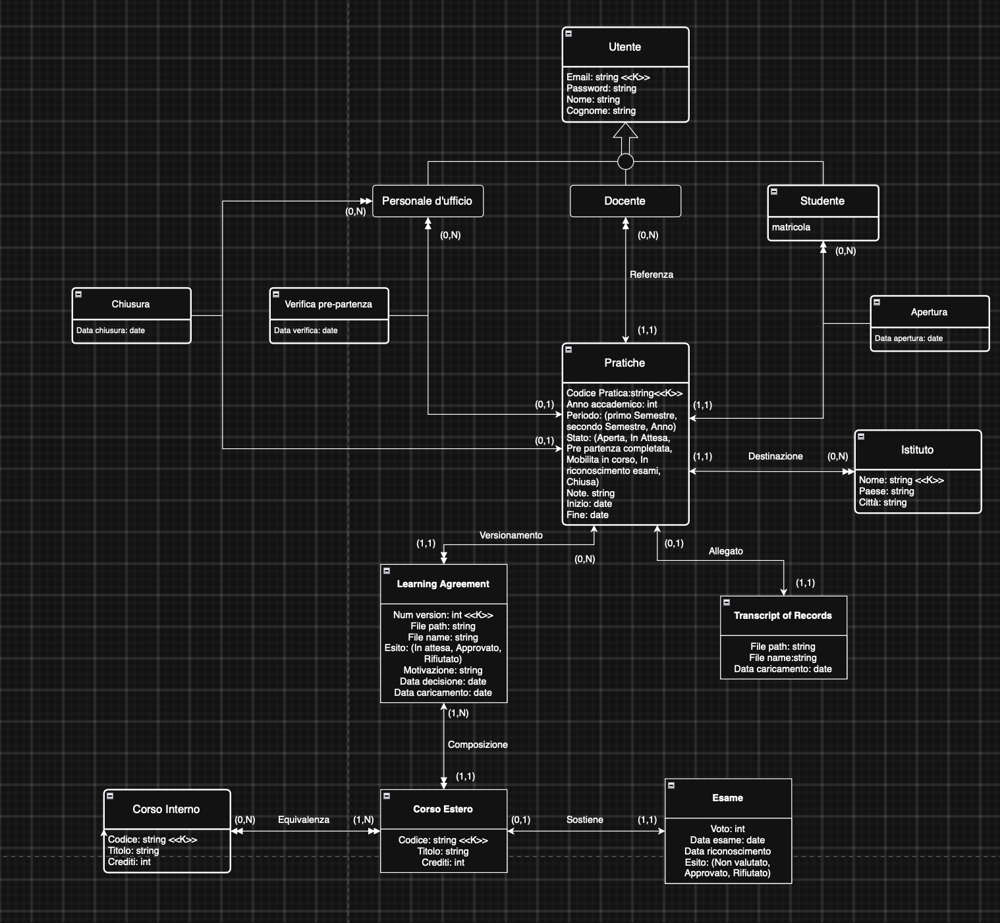
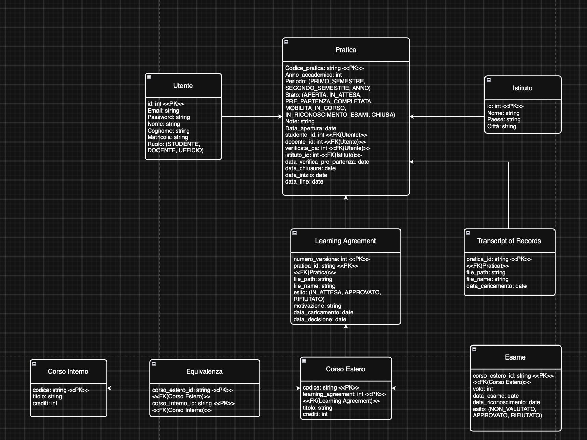

# Relazione di progetto — Piattaforma Overseas

Progetto di **Basi di Dati Mod. 2** — A.A. 2025/2026 — Università Ca’ Foscari Venezia.

[toc]

---

## 1. Introduzione

L’applicazione **Overseas** è una piattaforma web per la gestione delle pratiche di mobilità studentesca Overseas. Permette di seguire l’intero ciclo di vita di una pratica: apertura, Learning Agreement (con versioni successive), verifica pre-partenza, mobilità, Transcript of Records, riconoscimento degli esami e chiusura.

I soggetti coinvolti sono tre: **studente**, **docente referente** e **personale d’ufficio**. Ognuno opera solo sulle azioni previste dal proprio ruolo.

Il documento è organizzato come segue:

1. funzionalità principali;
2. progettazione concettuale e logica della base di dati;
3. selezione delle query più rilevanti;
4. principali scelte progettuali (integrità, autorizzazioni, indici, allegati, stati);
5. informazioni tecniche e di contesto;
6. in appendice, contributo di ciascun componente del gruppo.

---

## 2. Funzionalità principali

Le funzionalità seguono il percorso della pratica e i tre ruoli.

### Autenticazione

- Login con email e password.
- Logout.
- Dopo l’accesso, ogni utente vede solo le aree previste dal proprio ruolo.

### Studente

- Visualizzare le proprie pratiche.
- Aprire una nuova pratica (istituto ospitante, docente referente, anno e periodo).
- Compilare il Learning Agreement: corsi esteri, equivalenze con corsi interni, caricamento del PDF firmato.
- Inviare il LA al docente; in caso di rifiuto, preparare una nuova versione.
- Registrare l’inizio della mobilità.
- Al rientro: caricare il Transcript of Records e inserire i voti degli esami sostenuti.
- Consultare lo stato della pratica e lo storico delle versioni del LA.

### Docente referente

- Elenco delle pratiche di cui è referente, con evidenza di quelle in attesa di decisione.
- Approvare o rifiutare il Learning Agreement (il rifiuto richiede una motivazione).
- Valutare il riconoscimento degli esami (`ACCETTATO` / `RIFIUTATO`).

### Personale d’ufficio

- Elenco di tutte le pratiche.
- Consultazione del Learning Agreement.
- Verifica pre-partenza.
- Chiusura della pratica quando le condizioni sono soddisfatte (supporto della vista `v_pratiche_pronte_per_chiusura`).

### Stati della pratica (sintesi)

La pratica attraversa, in ordine tipico:

1. `APERTA`
2. `ATTESA_APPROVAZIONE_LA`
3. `PRE_PARTENZA_COMPLETATA`
4. `MOBILITA_IN_CORSO`
5. `IN_RICONOSCIMENTO_ESAMI`
6. `CHIUSA`

Le transizioni ammesse sono definite nel database (tabella `transizione_ammessa`) e controllate da trigger.

---

## 3. Progettazione concettuale e logica della base di dati

### Spiegazione modello concettuale



Le entità forti sono rappresentate tramite rettangoli con angoli smussati, mentre le entità deboli presentano angoli retti.

- Gerarchia utente: abbiamo creato un’entità padre Utente con 3 sottoclassi partizione, in cui un utente deve obbligatoriamente rientrare in una delle tre categorie ed uno stesso utente non può appartenere a più di una classe. Utente raccoglie i dati comuni condivisi da tutte le sottoclassi (email, password, nome, cognome); l’unico ruolo a cui aggiungiamo un attributo è la sottoclasse studente, per cui aggiungiamo la matricola.

- Relazione Apertura (Studente - Pratiche): la cardinalità (0,N) tra studente e pratica soddisfa il requisito per cui lo studente può non avere alcuna pratica di mobilità nel corso del suo percorso di studi, oppure può avere più pratiche di mobilità corrispondenti al suo utente. Dall’altro lato, la pratica deve riferirsi ad un solo studente. Salva la data di apertura come attributo della relazione.

- Relazione Referenza (Docente - Pratiche): ogni pratica può far riferimento ad un solo docente, che è necessario per la costituzione della pratica. Per questo la cardinalità (1,1) obbliga la presenza di un solo docente per pratica. Tuttavia, un solo docente può riferire per più pratiche, oppure per nessuna.

- Relazione Destinazione (Pratiche - Istituto): ogni pratica fa riferimento ad un solo istituto ospitante, la quale presenza è imperativa per la costituzione della pratica (1,1). D’altro canto, i vari istituti possono o meno appartenere a una o più pratiche.

- Relazione Verifica pre-partenza e Chiusura (Personale d’ufficio - Pratiche): abbiamo creato due relazioni distinte per gestire due azioni differenti che l’ufficio compie rispetto alla pratica. Entrambe mostrano come un impiegato dell’ufficio possa occuparsi di queste azioni su nessuna o più pratiche. L’opzionalità (0,1) dal lato dell’entità pratiche è necessaria per permettere alle pratiche di assumere gli stati intermedi prima della verifica e della chiusura da parte dell’ufficio. Alle relazioni sono aggiunti gli attributi per salvare la data in cui avviene l’operazione.

- Relazione Versionamento (Pratiche – Learning Agreement): la cardinalità (0,N) permette lo stato iniziale della pratica, che non presenta nessun Learning Agreement caricato, e allo stesso tempo consente il caricamento di diverse versioni del documento in seguito a modifiche. Dall’altro lato, ogni Learning Agreement deve far riferimento ad una sola pratica, che è necessaria per l’esistenza del documento (entità debole).

- Relazione Allegato (Pratiche – Transcript of Records): a fine percorso, è necessario il caricamento del Transcript, che in questo caso esiste in versione singola all’interno della pratica (0,1). Come il Learning Agreement, la sua esistenza è condizionata dall’esistenza della pratica.

- Relazione Composizione (Learning Agreement – Corso Estero): il Learning Agreement deve contenere almeno un corso estero. Il corso estero può far riferimento ad un solo Learning Agreement.

- Relazione Equivalenza (Corso Estero – Corso Interno): i corsi esteri, per essere inseriti nel Learning Agreement, è necessario che trovino corrispondenza in almeno un corso interno dell’università a cui appartiene lo studente. Dall’altro lato, i corsi interni possono non trovare mai corrispondenza con i corsi delle altre università, oppure possono essere stati corrisposti anche a diversi corsi esterni.

- Relazione Sostiene (Corso Estero - Esame): nelle fasi iniziali di mobilità, il corso estero non ha ancora corrispondenza con un esame, poiché lo studente deve ancora sostenerlo. Per ogni corso estero sostenuto in mobilità, lo studente ha l’opportunità di svolgere un solo esame. Dall’altro lato, un esame sostenuto ha bisogno di un singolo corso estero a cui far riferimento.

### Trasformazione a modello relazionale



- Relazione Unica Utente: la gerarchia tra entità padre Utente e le 3 sottoclassi Studente, Docente e Ufficio è stata tradotta in un’unica entità contenente tutti gli attributi già presenti in Utente, l’attributo matricola presente in studente e un nuovo attributo “Ruolo” che funge da discriminante per specificare la sottoclasse a cui mi sto riferendo. Questa strategia di traduzione delle sottoclassi è stata scelta data la conformazione delle sottoclassi, le quali differivano dall’entità padre di pochi attributi.

- Relazioni rivolte a Pratica: nel modello concettuale, Pratica era legata a Utente ed Istituto con diverse associazioni con attributi propri. Nel modello relazionale, queste associazioni sono state tradotte inserendo in Pratica le Foreign key corrispondenti ad ogni ruolo coinvolto di Utente (studente_id, docente_id, verificata_da per ufficio) e una Foreign key per l’associazione con istituto (istituto_id). Inoltre, l’entità Pratica ha assorbito tutti gli attributi presenti nelle varie associazioni con l’entità Utente (data_apertura, data_verifica_pre_partenza, data_chiusura).

- Entità deboli (Learning Agreement e Corso Estero): denotiamo la struttura debole dell’entità Learning Agreement dalla forma della sua chiave primaria, che è composta dalla combinazione del numero_versione del Learning Agreement con il numero identificativo della pratica (pratica_id): questo dimostra la dipendenza stretta tra Learning Agreement rispetto all’entità Pratica. Lo stesso tipo di dipendenza lo troviamo anche in Corso Estero, che insieme al codice del corso, ha bisogno del numero di Learning Agreement per identificare ogni sua istanza.

- Mappatura relazioni (1,1): nel modello concettuale, abbiamo 2 associazioni di tipo (1,1): Transcript of Records – Pratica e Esame – Corso Estero. Entrambe le entità Transcript ed Esame andranno a utilizzare la chiave esterna, ottenuta dalle rispettive relazioni, come chiavi primarie. Questo vincolo assicura che ci possa essere un solo Trascript per Pratica e un solo Esame per Corso Estero.

- Mappatura relazione (N,M): l’unica relazione molti a molti nel modello è Equivalenza, che si trova tra Corsi Interni e Corsi Esteri. Per tradurre questo tipo di associazione, è necessario creare una relazione che conterrà le chiavi esterne delle entità che collega.

Politiche referenziali (in sintesi):

- verso `utente` / `istituto` / `corso_interno`: in genere `RESTRICT` (non si cancella un soggetto ancora referenziato);
- da `pratica` verso documenti e corsi della pratica: in genere `CASCADE` (se si elimina la pratica, si eliminano i figli dipendenti).

---

## 4. Query principali

Di seguito una selezione di interrogazioni usate dall’applicazione. Il codice le costruisce con SQLAlchemy Expression Language usando selectinload, una tecnica che recupera tutti i dati collegati in un solo colpo invece di fare tante richieste separate al database. Qui si riporta l’SQL equivalente.

Nella relazione ci sono **4 query**. Ecco per ciascuna SQLAlchemy, SQL classico, file e contesto.

---

### Q1 — Esami ancora da valutare sul LA approvato

Conta il numero di esami associati a un Learning Agreement approvato che hanno uno stato di riconoscimento impostato su "NON_VALUTATO" per una specifica pratica. Permette al sistema di verificare se rimangono esami in attesa di valutazione da parte del docente.

**SQLAlchemy** (`app/blueprints/pratiche.py`, funzione `_esami_da_valutare`):

```python
n = db.session.scalar(
    sa.select(sa.func.count(Esame.id))
    .join(CorsoEsterno)
    .join(LearningAgreement)
    .where(LearningAgreement.pratica_id == pratica.id)
    .where(LearningAgreement.esito == EsitoDocumento.APPROVATO)
    .where(Esame.esito_riconoscimento == "NON_VALUTATO")
)
```

Stessa logica anche in `app/blueprints/docente.py`, funzione `_ci_sono_esami_da_valutare` (confronta se il conteggio è `> 0`).

**SQL classico:**

```sql
SELECT COUNT(esame.id)
  FROM esame
  JOIN corso_esterno
    ON corso_esterno.id = esame.corso_esterno_id
  JOIN learning_agreement
    ON learning_agreement.id = corso_esterno.learning_agreement_id
 WHERE learning_agreement.pratica_id = :id_pratica
   AND learning_agreement.esito = 'APPROVATO'
   AND esame.esito_riconoscimento = 'NON_VALUTATO';
```

---

### Q2 — Corsi del LA operativo senza voto definitivo

Verifica la presenza di corsi esterni all'interno del Learning Agreement approvato che non hanno un esame registrato oppure il cui esito di riconoscimento è ancora "NON_VALUTATO".

**SQLAlchemy** (`app/blueprints/pratiche.py`, funzione `_restano_voti_da_inserire`):

```python
n = db.session.scalar(
    sa.select(sa.func.count(CorsoEsterno.id))
    .outerjoin(Esame)
    .where(CorsoEsterno.learning_agreement_id == versione.id)
    .where(sa.or_(
        Esame.id.is_(None),
        Esame.esito_riconoscimento == "NON_VALUTATO",
    ))
)
return (n or 0) > 0
```

(`versione` = LA approvato della pratica)

**SQL classico:**

```sql
SELECT COUNT(corso_esterno.id)
  FROM corso_esterno
  LEFT JOIN esame
    ON esame.corso_esterno_id = corso_esterno.id
 WHERE corso_esterno.learning_agreement_id = :id_versione_approvata
   AND (
         esame.id IS NULL
      OR esame.esito_riconoscimento = 'NON_VALUTATO'
       );
```

---

### Q3 — Pratiche pronte per la chiusura (vista)

Estrae gli ID di tutte le pratiche pronte per la chiusura formale interrogando la vista PostgreSQL v_pratiche_pronte_per_chiusura. Filtra le pratiche nello stato IN_RICONOSCIMENTO_ESAMI che non hanno più esami da valutare (pari a 0) e che possiedono già un Transcript caricato.

**SQLAlchemy** (`app/blueprints/ufficio.py`, funzione `_id_pronte_per_chiusura`):

```python
righe = db.session.execute(
    sa.text("SELECT pratica_id FROM v_pratiche_pronte_per_chiusura")
).all()
return {riga.pratica_id for riga in righe}
```

Qui si usa `sa.text()` perché la vista è specifica di PostgreSQL.

**SQL classico (uso):**

```sql
SELECT pratica_id
  FROM v_pratiche_pronte_per_chiusura;
```

**Definizione della vista** (`scripts/schema_extra_postgres.sql`):

```sql
CREATE OR REPLACE VIEW v_pratiche_pronte_per_chiusura AS
SELECT sr.pratica_id,
       sr.codice_pratica,
       sr.esami_registrati,
       sr.esami_accettati,
       sr.crediti_riconosciuti
  FROM v_stato_riconoscimento_pratica sr
 WHERE sr.stato = 'IN_RICONOSCIMENTO_ESAMI'
   AND sr.esami_da_valutare = 0
   AND EXISTS (
         SELECT 1
           FROM transcript t
          WHERE t.pratica_id = sr.pratica_id
       );
```

---

### Q4 — Avanzamento del riconoscimento e crediti (vista)

Definisce una vista SQL (v_stato_riconoscimento_pratica) che calcola gli indicatori e le statistiche complessive per ciascuna pratica: totale esami registrati, valutati, da valutare, accettati e somma dei crediti riconosciuti.
Non c’è una query SQLAlchemy diretta nell’app. La vista è definita direttamente in SQL per essere utilizzabile dalla vista `v_pratiche_pronte_per_chiusura`

**Definizione** (`scripts/schema_extra_postgres.sql`):

```sql
CREATE OR REPLACE VIEW v_stato_riconoscimento_pratica AS
SELECT p.id                                     AS pratica_id,
       p.codice_pratica,
       p.stato,
       lac.learning_agreement_id,
       count(e.id)                              AS esami_registrati,
       count(e.id) FILTER (
           WHERE e.esito_riconoscimento <> 'NON_VALUTATO')  AS esami_valutati,
       count(e.id) FILTER (
           WHERE e.esito_riconoscimento =  'NON_VALUTATO')  AS esami_da_valutare,
       count(e.id) FILTER (
           WHERE e.esito_riconoscimento =  'ACCETTATO')     AS esami_accettati,
       COALESCE(sum(ci.crediti) FILTER (
           WHERE e.esito_riconoscimento = 'ACCETTATO'), 0)  AS crediti_riconosciuti
  FROM pratica p
  LEFT JOIN v_learning_agreement_corrente lac ON lac.pratica_id = p.id
  LEFT JOIN corso_esterno ce
         ON ce.learning_agreement_id = lac.learning_agreement_id
  LEFT JOIN esame e        ON e.corso_esterno_id = ce.id
  LEFT JOIN equivalenza eq ON eq.corso_esterno_id = ce.id
  LEFT JOIN corso_interno ci ON ci.id = eq.corso_interno_id
 GROUP BY p.id, p.codice_pratica, p.stato, lac.learning_agreement_id;
```

---

## 5. Principali scelte progettuali

### 5.1 Politiche di integrità

Le regole sono distribuite su più livelli:

- **CHECK e UNIQUE** nelle tabelle (dominio, unicità, coerenza “o entrambi o nessuno” su date e riferimenti all’ufficio).
- **Chiavi esterne** con `RESTRICT` o `CASCADE` a seconda che il riferimento sia a un soggetto stabile o a un figlio della pratica.
- **Trigger PostgreSQL** (file `scripts/schema_extra_postgres.sql`) per ciò che un CHECK su una sola riga non può esprimere, ad esempio:
  - coerenza dei ruoli sulle FK di `pratica` (conseguenza del collasso della gerarchia utente);
  - controllo delle transizioni di stato e del ruolo che le effettua;
  - immutabilità della pratica chiusa;
  - vincoli su creazione/modifica del Learning Agreement e registrazione degli esami.
- **Controlli applicativi** (Flask) per messaggi chiari all’utente e per non proporre azioni impossibili; il database resta comunque l’ultima garanzia.

L’identità dell’utente applicativo è comunicata a PostgreSQL all’inizio di ogni richiesta (`set_config('app.utente_id', …)`), così i trigger possono verificare il ruolo senza cambiare utente di connessione.

### 5.2 Ruoli e politiche di autorizzazione

Ruoli applicativi: `STUDENTE`, `DOCENTE`, `UFFICIO`.

- Decoratore `@ruolo_richiesto`: limita le aree (es. `/studente`, `/docente`, `/ufficio`).
- Controllo di appartenenza sulla pratica:
  - studente: solo le proprie;
  - docente: solo quelle di cui è referente;
  - ufficio: tutte.
- In caso di accesso non consentito a una pratica si risponde in genere con **404** (non si rivela se la risorsa esiste).
- Password memorizzate come hash (Werkzeug), non in chiaro.

### 5.3 Uso di indici e viste

Indici principali (motivati dalle liste e dai filtri frequenti):

- su `pratica`: `studente_id`, `docente_id`, `stato`, (`anno_accademico`, `stato`);
- su `learning_agreement`: `pratica_id`, `esito`, più indice unico parziale “una sola versione `IN_ATTESA` per pratica”;
- su `esame`: `esito_riconoscimento`;
- su `equivalenza`: `corso_interno_id`.

Viste:

- `v_learning_agreement_corrente` — ultima versione approvata per pratica;
- `v_stato_riconoscimento_pratica` — avanzamento riconoscimenti e crediti;
- `v_pratiche_pronte_per_chiusura` — pratiche chiudibili dall’ufficio.

### 5.4 Gestione degli allegati

- I file stanno **fuori** da `static/`, così non sono serviti pubblicamente.
- Sul disco il nome è un **UUID**; il nome originale resta solo nel database, per la visualizzazione.
- Sono ammessi solo PDF, con limite di dimensione.
- Download solo tramite route autenticate che verificano il permesso sulla pratica.
- Il Learning Agreement può essere anche generato in PDF dall’applicazione (`fpdf2`).

### 5.5 Stati della pratica

Le transizioni ammesse sono:

| Da | A | Ruolo |
|---|---|---|
| `APERTA` | `ATTESA_APPROVAZIONE_LA` | STUDENTE |
| `ATTESA_APPROVAZIONE_LA` | `APERTA` | DOCENTE |
| `ATTESA_APPROVAZIONE_LA` | `PRE_PARTENZA_COMPLETATA` | UFFICIO |
| `PRE_PARTENZA_COMPLETATA` | `MOBILITA_IN_CORSO` | STUDENTE |
| `MOBILITA_IN_CORSO` | `IN_RICONOSCIMENTO_ESAMI` | STUDENTE |
| `IN_RICONOSCIMENTO_ESAMI` | `CHIUSA` | UFFICIO |

Sono memorizzate in `transizione_ammessa` e imposte da trigger: la macchina a stati è un dato, non solo codice Python.

### 5.6 Transazioni e livelli di isolamento

Le operazioni di scrittura passano dalla sessione SQLAlchemy e sono confermate con commit a fine richiesta riuscita.

---

## 6. Ulteriori informazioni

### Stack tecnologico

- **Python** 3.11+
- **Flask** — applicazione web
- **Flask-Login** — sessione utente
- **Flask-SQLAlchemy / SQLAlchemy 2** — ORM e Expression Language
- **PostgreSQL** — DBMS di riferimento (trigger, viste, indici parziali); SQLite usabile in locale per avvio rapido, senza le estensioni PostgreSQL
- **psycopg** — driver PostgreSQL
- **Jinja2** + **Bootstrap 5** (CDN) — interfaccia
- **fpdf2** — generazione PDF del Learning Agreement
- **python-dotenv** — configurazione da `.env`
- **Werkzeug** — hash password e utilità upload

### Organizzazione del codice

L’applicazione è costruita con Flask e suddivisa in **blueprint** per area: *autenticazione*, *studente*, *docente*, *ufficio* e un blueprint condiviso *<u>/pratiche</u>* per il dettaglio della pratica, usato da tutti i ruoli. 

Dentro **app/** le responsabilità sono separate: 

- models.py descrive le tabelle, 
- security.py gestisce i controlli di ruolo e di appartenenza alla pratica,
-  documenti.py si occupa di upload e PDF, mentre le route si limitano a leggere la richiesta, verificare i permessi e restituire la pagina. 

> Indice
>
> - `app/models.py` — schema logico
> - `app/blueprints/` — route per ruolo / area
> - `app/security.py` — autorizzazioni
> - `app/documenti.py` — allegati e PDF

Configurazione e avvio stanno nella radice; gli script di creazione del database, seed e trigger PostgreSQL stanno in **scripts/**. 

> **Indice**
>
> - `scripts/init_db.py`, `scripts/seed.py`, `scripts/schema_extra_postgres.sql` — creazione schema, dati di prova, trigger/viste
> - `scripts/collaudo.sql` — controlli di integrità in transazione di prova

Il **flusso** di ogni pagina è sempre lo stesso: URL → blueprint → controllo accesso → lettura/scrittura dei dati → template HTML.

---

## Appendice — Contributo al progetto

### Componente 1

**Serpelloni Leonardo**

- **Progettazione:** analisi dei requisiti funzionali e definizione dei flussi della pratica di mobilità, dalla candidatura alla chiusura.
- **Sviluppo:** applicazione web (pagine, percorsi utente e operazioni sulle pratiche per studente, docente e ufficio).
- **Documentazione:** descrizione del funzionamento dell’applicazione e delle istruzioni d’uso.

### Componente 2

**Mattia Rosin**

- **Progettazione:** modello dei dati, ruoli e vincoli di accesso, e organizzazione generale del progetto.
- **Sviluppo:** modelli, struttura dell’applicazione e controlli di sicurezza (autenticazione e permessi per ruolo).
- **Documentazione:** documentazione del modello dei dati e delle scelte di progetto.
